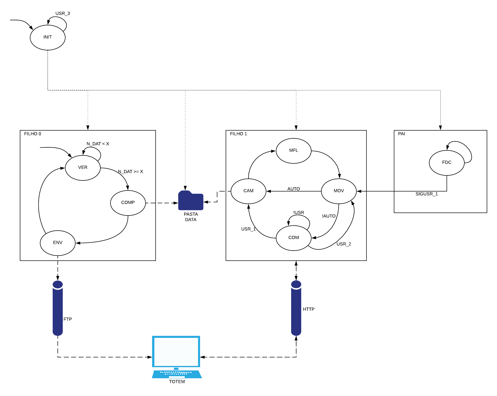

<h1 align="center">
  <a href="https://github.com/pi2-fga/201901-InspecaoCaboDeAco-Frontend" target="_blank">
    
  </a>
</h1>

<p align="center">
  Este projeto é referente ao <i>Mock</i> para simular as atividades de comando e controle do Robô de Inspeção de Cabo de Aço, da disciplina de PI2, desenvolvido em:<br>
  <strong>Node, Express, jsftp e node-zip.</strong>
</p>

<p align="center">
  <a href="https://nodejs.org/es/blog/release/v10.15.3/">
    
  </a>
  <a href="https://expressjs.com/pt-br/">
    
  </a>
  <a href="https://www.npmjs.com/package/jsftp">
    
  </a>
  <a href="https://www.npmjs.com/package/node-zip">
    
  </a>
</p>

# 📋 Descrição

O projeto _mock_ é um sistema desenvolvido para o projeto de Inspeção de Cabos de Aço da disciplina de Projeto Integrado 2 da Universidade de Brasília, campus FGA, Faculdade do Gama.

## 💪 Motivação

Basicamente, as últimas etapas de desenvolvimento do projeto consistem em desenvolver uma solução para inspeção automatizada do cabo e, junto a isso, uma validação/teste dos componentes/subsistemas da solução gerada. Após isso, há uma etapa de integração entre os subsistemas da solução (Engenharia de Software e Engenharia Eletrônica/Energia).

Com isso, para mitigar os riscos da ultima etapa de integração e possibilitar o desenvolvimento e teste da solução de software sem a necessidade da solução desenvolvida pela equipe de eletrônica/energia, foi-se desenvolvido um sistema para simular todas as atividades que o robô de inspeção realizaria.

## 🛠 Features
O sistema, para simular corretamente o functionamento do robô, deve possuir as seguintes características:
- Fornecer um endpoint HTTP para recebimento de comandos de controle;
- Servir como cliente FTP para envio de arquivos;
- Simular envio de arquivos por meio de FTP para envio de imagens e informações de sensores de tempos em tempos;
- Armazenar a máquina de estados para controlar o estado atual do robô;
- Permitir receber comandos de 'start', 'stop', 'pause', 'wait' e comandos de orientação, como 'left' e 'right';
- Simular o deslocamento do robô e armazenar o mesmo.



## 📁 Arquitetura de pastas

Para a organização o projeto, foi identificada a necessidade de, basicamente, 3 grandes funcionalidades:
- Servidor HTTP;
- Cliente FTP;
- Máquina de estados.

Alguns outros arquivos auxiliares foram criados para ajudar na correta organização do projeto.

``` sh
src
├── api
│   └── control.js
├── ftp-client.js
├── helpers
│   └── generics.js
├── index.js
└── state-machine
    ├── continue.js
    ├── index.js
    ├── init.js
    ├── pause.js
    ├── reset.js
    └── state.js
```

- **api**: é a pasta que armazena todos os _endpoints_ para as requisições HTTP e respostas do mesmo protocolo na comunicação com o _mock_;
- **ftp-client**: é o arquivo que realizar toda a configuração e fornecimento para todo o sistema de um cliente FTP para o envio de arquivos para o servidor FTP, no caso, o [main-server](https://github.com/pi2-inspecao-cabo-de-aco/main-server);
- **helpers**: arquivos que contenham funções que são compartilhadas e podem ser utilizadas por um ou mais módulos ou arquivos;
- **index**: arquivo que centraliza a inicialização e todas as chamadas de configuração dos demais módulos. Funciona como a _main_ do projeto.
- **state-machine**: armazena a máquina de estados e todas as funções que fazem o controle da mesma, descritas cada um em um arquivo, como é possível ver na estrutura supracitada.

## 💻 Processo de instalação

O projeto funciona, basicamente, como um cliente FTP e um servidor HTTP. Para tal, é necessário a configuração dos HOSTs e PORTs para que eles possam se comunicar. Para isso, existem as variáveis de ambiente explicadas à seguir:
- **FTP_HOST**: variável para configurar o IP do serviço que configurado para ser o servidor FTP, no caso o [main-server](https://github.com/pi2-fga/201901-InspecaoCaboDeAco-MainServer);
- **FTP_PORT**: variável para configurar a porta a qual o cliente FTP estará disponível. Por padrão, a porta é mapeada para a port 30003;
- **HTTP_PORT**: variável para configurar o servidor HTTP, mapeada por padrão para a porta 3030.

O projeto foi todo construído e configurado utilizando _containers_, mais especificamente o [Docker](https://www.docker.com/). Com isso, é necessário que se tenha instalado tanto o Docker quanto o [docker-compose](https://docs.docker.com/compose/) na máquina.

Com isso, para executar o serviço basta executar o seguinte comando na linha de comando:
``` sh
~$ docker-compose up --build
```

**OBSERVAÇÃO**: Todos os serviços contidos no `docker-compose.yml` são mapeados por padrão para a [network](https://docs.docker.com/compose/networking/) `backend`, ou seja, os serviços tentarão se comunicar pelos IPs e portas que executam nessa mesma _network_. Com isso, é ESTRITAMENTE necessário que, antes de executar o comando acima, o serviço [main-server](https://github.com/pi2-fga/201901-InspecaoCaboDeAco-MainServer) já esteja sendo executado, visto que o mesmo cria a _network_ denominada `backend`, configurada no _compose file_.

Com isso, o serviço estará disponível para uso.

## ⚙ Funcionamento, Entradas e Saídas

A base do funcionamento do serviço é por meio do protocolo HTTP. Com isso, existem as seguintes URLs disponíveis:
- **'/control'**: esse _endpoint_ deve receber um comando do tipo POST possuindo o seguinte parâmetro: `{ command: 'comando_de_controle' }`. Esse parâmetro pode possuir os seguintes valores:
  - **start**: comando para iniciar a análise do cabo de aço;
  - **pause**: comando para parar o robô na posição em que o mesmo se encontra para o inspetor observar com mais detalhes as informações ali contidas;
  - **continue**: comando para dar continualidade a análise que foi parada anteriormente;
  - **reset**: comando para cancelar a análise e retornar o robô para a posição inicial.

## 🚀 Tecnologias

O sistema foi desenvolvido utilizando Node configurado em um container Docker utilizando a imagem `node:alpine`. As principais tecnologias utilizadas são:
- **express**: _framework web_ que possibilita a criação, configuração e uso de maneira fácil e intuitiva de servidores HTTP. Veja mais em https://expressjs.com/pt-br/
- **jsftp**: biblioteca que possibilita a criação de um cliente FTP. Veja mais em https://www.npmjs.com/package/jsftp
- **node-zip**: biblioteca de FileSystem que permite a manipulação de arquivos para a criação de arquivos .ZIP. Veja mais em https://www.npmjs.com/package/node-zip
